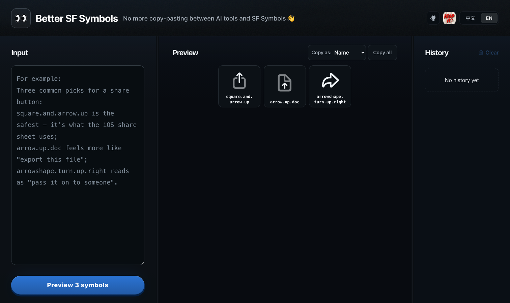

# Better SF Symbols

English · [简体中文](README.zh-CN.md)

**Live: https://sfsymbols.terryhu.workers.dev**



Paste an AI reply, see every SF Symbol in it as a real picture, click one to copy it.

AI can only give you *names* — "use `square.and.arrow.up`, or maybe `arrow.up.doc`". Names do not
tell you what a thing looks like, so you end up copying each one into the SF Symbols app and back.
This site deletes that round trip: paste the whole reply, the symbols are recognised, the real
glyphs are laid out side by side, and clicking one copies it. The name is what a click copies by
default — that is the thing you paste back into a string literal the AI already wrote — and the
format control beside the grid switches it to `Image(systemName:)`, `UIImage(systemName:)` or
`NSImage(systemSymbolName:)`, remembered for next time.

Everything runs in the browser. Nothing you paste is uploaded — enforced by `connect-src 'self'`
in `worker/index.ts`, not just promised.

## Run it

```bash
npm install
npm run dev            # http://localhost:3000
npm test               # builds, then asserts SSR output + tile geometry
npm run lint
```

## The symbol catalogue

All 7,988 names, their iOS versions, and their pictures are **generated from macOS itself** —
Apple ships no symbol API, but every Mac carries the authoritative list in `CoreGlyphs.bundle`.
Neither is ever hand-edited.

```bash
node scripts/sync-symbol-catalog.mjs   # names + versions + trademark notes (seconds)
swift scripts/render_sfsymbols.swift   # 7,988 mask PNGs, favicon, OG card (~65s, needs a Mac)
```

Because the source is the OS, the catalogue updates when the OS does: run both on a Mac with a
newer macOS and that year's new symbols are simply there. SF Symbols is not in the system font's
private-use area (`SFNS.ttf` has exactly one PUA codepoint), so the artwork can only come from a
Mac — there is no API and no other source.

## Deploy

```bash
npm run build
npx wrangler deploy
```

A Cloudflare Worker with static assets — SSR is kept, so the interface language still follows the
request's `Accept-Language`. The wrangler config is generated into `dist/server/wrangler.json` by
the Vite plugin; the worker name comes from `package.json`'s `name`.

Security headers live in `worker/index.ts`, **not** in `public/_headers` — Cloudflare applies that
file to static asset responses only, so a CSP written there never reaches the server-rendered HTML.
`_headers` still owns caching for `/symbols/*`. After any header change, check the real thing:

```bash
curl -sI https://sfsymbols.terryhu.workers.dev | grep -i content-security-policy
```

## Layout

| Path | What it is |
|---|---|
| `app/` | The whole product. `symbol-flow.tsx` is the UI, `messages.ts` holds every user-visible string |
| `scripts/` | The generators (catalogue, artwork) and `ui-probe.mjs`, the self-verification tool |
| `tests/` | SSR output, source invariants, and the tile-geometry properties |
| `public/symbols/` | Generated artwork — disposable, rebuilt by the Swift script |

Scaffold leftovers this project never uses: `app/chatgpt-auth.ts`, `db/`, `drizzle*`,
`examples/d1/`.

`.openai/hosting.json` looks like a leftover and is not — `vite.config.ts` imports it and
`build/sites-vite-plugin.ts` copies it, so deleting it breaks `npm run build`. It is a build
input, not a deploy target.
