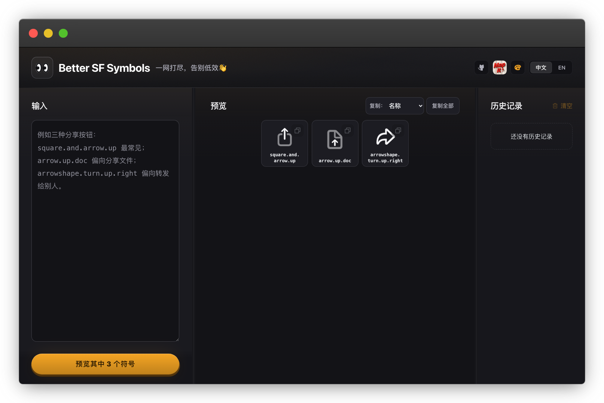

# Better SF Symbols

[English](README.md) · 简体中文

[](https://sfsymbols.terryhu.workers.dev)

### 地址：[sfsymbols.terryhu.workers.dev](https://sfsymbols.terryhu.workers.dev)

一网打尽文本里的所有图标符号，从此告别低效👋

## 苹果开发者+符号选择困难症终于有救了！

Vibe Coding时代，总会遇到下面这个情景。

开发新功能，选按钮图标时候，让AI推荐三个时一般会收到如下回复:
square.and.arrow.up 最常见；
arrow.up.doc 偏向分享文件；
arrowshape.turn.up.right 偏向转发给别人。

于是开始一个个复制粘贴，来回切到SF Symbols.app，看看那个图标长什么样，最后只能凭着印象选出一个。

用上这个工具后，只需copy整段AI回复后粘贴一次，页面会自动提取出来所有图标符号，一网打尽。

## 本地运行方式

```bash
npm install
npm run dev     # http://localhost:3000
npm test        
```

## 目录结构

| 路径 | |
|---|---|
| `app/` | 产品本身 |
| `scripts/` | 两个生成器，外加 `ui-probe.mjs`——用真实浏览器量真实布局 |
| `tests/` | SSR 输出 |
| `public/symbols/` | 产物路径 |
